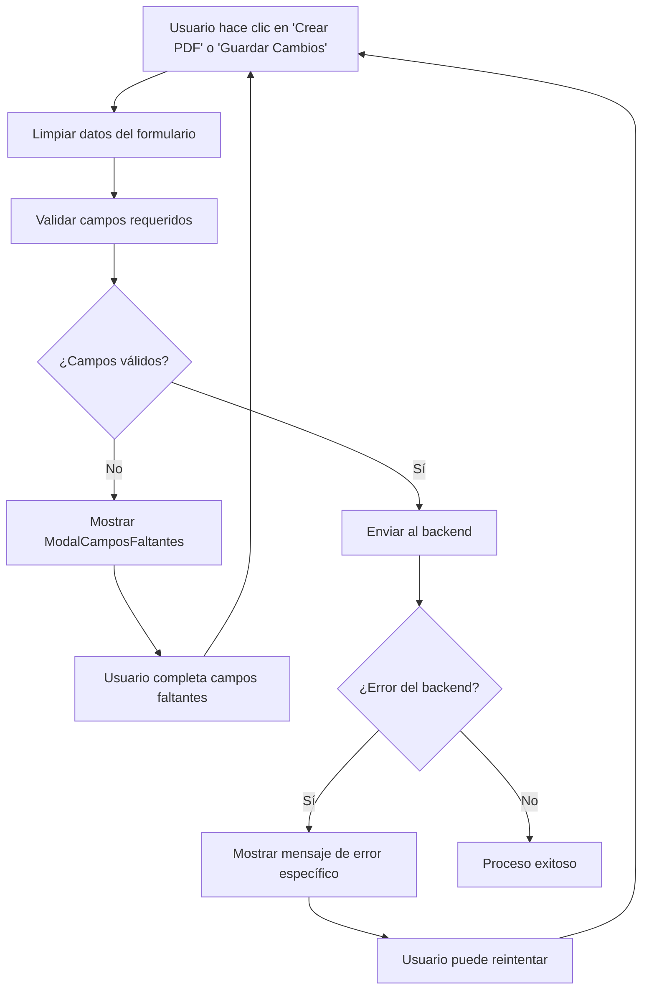

# Validación de Campos Requeridos - FormStepper

## Descripción

Se ha implementado un sistema robusto de validación de campos requeridos en el componente `FormStepper.vue` que mejora significativamente la experiencia del usuario (UX) al prevenir errores comunes antes de enviar datos al backend.

## Características Implementadas

### 1. Modal de Campos Faltantes Específicos (`ModalCamposFaltantes.vue`)

- **Diseño mejorado**: Modal con diseño moderno y animaciones suaves
- **Información detallada**: Muestra exactamente qué campos faltan con iconos específicos por tipo
- **Navegación contextual**: Indica en qué paso se encuentra cada campo faltante
- **Tipos de campos**: Diferencia entre fechas, medidas, texto, selecciones, etc.

### 2. Sistema de Validación (`validacionCampos.ts`)

- **Validación por tipo de documento**: Cada tipo de documento tiene sus propios campos requeridos
- **Validaciones específicas**: 
  - Fechas: Verifica formato válido
  - Números: Verifica que sean valores numéricos válidos
  - Texto: Verifica que no esté vacío
  - Selecciones: Verifica que tenga un valor seleccionado
- **Campos requeridos por documento**:
  - **Antidoping**: Fecha del examen, Resultado
  - **Aptitud**: Fecha del examen, Peso, Altura, IMC, Aptitud médica
  - **Audiometría**: Fecha del examen, Resultado
  - **Certificado**: Fecha del examen, Aptitud
  - **Exploración Física**: Fecha del examen, Peso, Altura, IMC, Presión arterial, etc.
  - Y muchos más...

### 3. Integración en FormStepper

- **Validación previa**: Se ejecuta antes de enviar datos al backend
- **Prevención de errores**: Evita llamadas innecesarias al servidor
- **UX mejorada**: El usuario sabe exactamente qué completar antes de continuar

### 4. Manejo de Errores Mejorado

- **Mensajes específicos**: Diferentes mensajes según el tipo de error del backend
- **Códigos de estado**: Manejo específico para errores 400, 404, 500, etc.
- **Errores de red**: Mensajes específicos para problemas de conectividad

## Flujo de Validación



## Beneficios

1. **Mejor UX**: El usuario sabe exactamente qué campos completar
2. **Menos errores**: Previene errores comunes como fechas faltantes
3. **Eficiencia**: Evita llamadas innecesarias al backend
4. **Claridad**: Mensajes específicos y contextuales
5. **Robustez**: Manejo mejorado de errores del servidor

## Uso

La validación se ejecuta automáticamente cuando el usuario intenta:
- Crear un PDF
- Guardar cambios
- Continuar al siguiente paso (si está habilitado)

No se requiere configuración adicional, ya que está integrado directamente en el flujo existente del `FormStepper.vue`.

## Personalización

Para agregar nuevos campos requeridos o modificar validaciones existentes, editar el archivo `frontend/src/helpers/validacionCampos.ts`:

```typescript
// Ejemplo: Agregar nuevo campo requerido
const camposRequeridosPorTipo = {
  nuevoTipoDocumento: [
    { campo: 'nuevoCampo', nombre: 'Nuevo Campo', tipo: 'texto', paso: 1, validacion: validarTexto }
  ]
};
```

